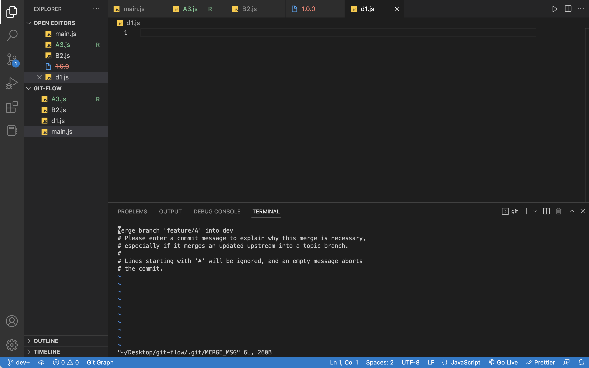
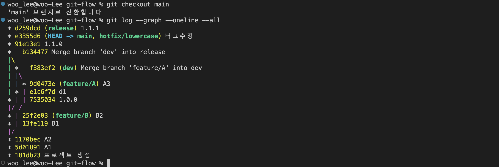

# Git-flow-example

### Git Flow 개요

- main(master) : 기본/메인/제품 브랜치
- dev(develop) : 다음 제품 출시를 위해 여러 기능을 병합하는 브랜치
- feature/\* : 각 기능 개발을 위한 브랜치 (feature로 시작하는 여러 기능 이름)
- release : 이번 제품 출시 직전 최종 테스트(QA)를 위한 브랜치 ⇒ 여기서 검수 완료되면 main 브랜치에 병합
- hotfix : 제품에 버그가 확인되었을 때 긴급 수정을 위한 브랜치 ⇒ main 브랜치에 병합했는데 버그가 발견되면 그건 긴급이므로

git init으로 처음 시작하면 main 브랜치가 생성되고 바로 dev 브랜치와 feature 브랜치를 만들고 개발을 시작한다.
feature 브랜치에서 기능들을 직접 개발하고 dev 브랜치는 여기에서 개발을 진행하는 건 아니고
다양한 기능들을 병합하고 정리하는 용도의 브랜치이므로 실질적인 기능 개발은 feature 브랜치에서 진행된다.

기능 2개를 feature/B, feature/A 브랜치에서 개발이 완료되더라도 바로 main으로 병합하는 게 아니라 release 브랜치를 거친다.
release 브랜치에서 최종 검수 과정을 거친다. 그래서 검수과정을 거쳐서 최종적인 버전을 하나 1.0.0부터 만들기 시작해 나가고, 이후에 업데이트 과정이 계속 반영되고 …

1.0.0이라는 최초 버전이 준비되면 이걸 main 브랜치로 병합해서 실제 product로 배포한다.
배포를 했더니 버그가 발생하면 hotfix 브랜치에서 버그를 수정한다. 이걸 main 브랜치에 병합하고.
이걸 사용자가 쓰고 있으면서도 어쨌든 버전을 업그레이드해야 하므로 release에도 병합을 해주면서 이어나간다.

---

### Git Flow 예제

최초 버전을 생성해주고

```shell
git init
git add .
git commit -m '프로젝트 생성'
```

브랜치를 생성해준다.

```shell
git branch dev
git branch feature/A
git branch --list # 브랜치 목록 확인
```

기능을 추가해줄 것이므로 feature/A로 이동한다.

```shell
git checkout feature/A
```

기능 개발을 하고 버전을 생성해준다.

```shell
git add .
git commit -m 'A1'
```

dev 브랜치로 이동해서 병합을 해준다.

```shell
git checkout dev
git merge feature/A # feature/A 브랜치를 dev 브랜치로 병합한다.
```

다시 feature/A에서 추가로 기능 개발이 필요하면

```shell
git checkout feature/A

# 기능 개발이 완료된 후 버전 생성
git add .
git commit -m 'A2'
```

그리고 이 feature/A 브랜치에서 추가적인 기능 개발이 필요하므로 feature/B 브랜치를 생성/이동하고 기능 개발을 한다.

```shell
git branch feature/B # 생성
git checkout feature/B # 이동

# 기능 개발을 완료한 뒤, 버전 생성을 해준다.
git add .
git commit -m 'B1'

# 여기서 또 추가 기능 개발을 완료한 뒤 버전을 생성해준다.
git add .
git commit -m 'B2'
```

B2까지 기능개발이 끝나면 이걸 dev 브랜치로 병합을 해줘야 한다.

```shell
git checkout dev
git merge feature/B
```

여기까지 개발이 완료됐다고 치고, 배포를 하려고 한다. main 브랜치를 가기 전에 release 브랜치를 생성한다.

```shell
git branch release # release 브랜치 생성
git checkout release # release 브랜치로 이동

# 개발된 기능들을 release 버전으로 종합한 뒤 버전을 생성해준다.
git add .
git commit -m '1.0.0'
```

이 릴리즈 버전을 실제로 배포해야 하므로 main 브랜치로 가서 병합을 해줘야 한다.

```shell
git checkout main
git merge release # 여기까지 하면 1.0.0 버전 배포가 완료된 것이다.
```

이후 dev 브랜치에서 업데이트할 게 생겼으면 dev 브랜치로 가서 작업 수행 후 버전을 생성해준다.

```shell
git checkout dev
git add .
git commit -m 'd1'
```

이 와중에 또 feature/A에서 기능 업데이트를 해야 하면 기능 개발 후 버전 생성한 뒤, 기능을 다시 dev 브랜치로 병합해준다.

```shell
git checkout feature/A
git add .
git commit -m 'A3'

git checkout dev
git merge feature/A # 이렇게 병합을 하면 아래 그림처럼 메시지가 뜨는데,
```



`#`으로 처리된 글들은 무시되는 주석이고
위에 기본적으로 `Merge branch ‘feature/A’ into dev` 메시지가 작성되어 있음.
이게 마음에 들면 그대로 쓰면 되고, 메시지가 마음에 안 들면 수정하면 된다.

마음에 든다고 가정하고 `:wq`로 저장하고 나온다.

이렇게 추가된 기능으로 또 다시 배포 과정을 밟을 것이다.

```shell
git checkout release
git merge dev # 마찬가지로 위 그림 또 뜨면 :wq 엔터로 저장

# 이렇게 release로 병합이 되면 또 버전을 생성해준다.
git add .
git commit -m '1.1.0'

# release 버전에 맞게 배포도 해줘야 하므로
git checkout main
git merge release
```

배포를 했더니 버그가 발견되었다면, 긴급하게 수정하기 위해 hotfix/lowercase 브랜치를 생성하고 이동해서 버그를 수정한다.

```shell
git branch hotfix/lowercase
git checkout hotfix/lowercase

# 버그를 수정한 뒤 버전을 생성해준다.
git add .
git commit -m '버그 수정'

# main 브랜치로 가서 병합을 해준다.
git checkout main
git merge hotfix/lowercase

# main 브랜치까지 병합을 해서 업데이트 했지만,
# 우리는 release로 버전을 관리하므로 relase에도 병합해줘야 한다.
git checkout release
git merge main

# 병합을 해줘서 release가 업데이트 되었으니 버전도 생성해준다.
# 근데 release는 어디까지나 중간다리 역할이므로 이렇게 버그 수정까지 업데이트하는 과정은 선택사항이다.
# 1.1.1로 마지막 숫자는 버그 수정 같은 거 할 때
git add .
git commit -m '1.1.1'

```

git-flow 전략은 팀마다 당연히 다르다.

지금까지 한 예제를 `git log —graph —oneline —all` 로 확인해보면 아래와 같다.


